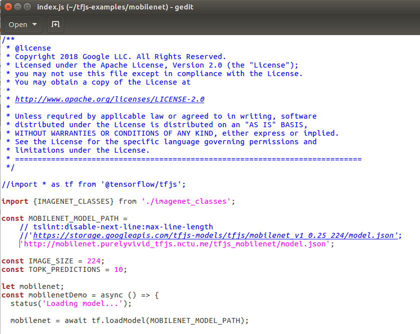
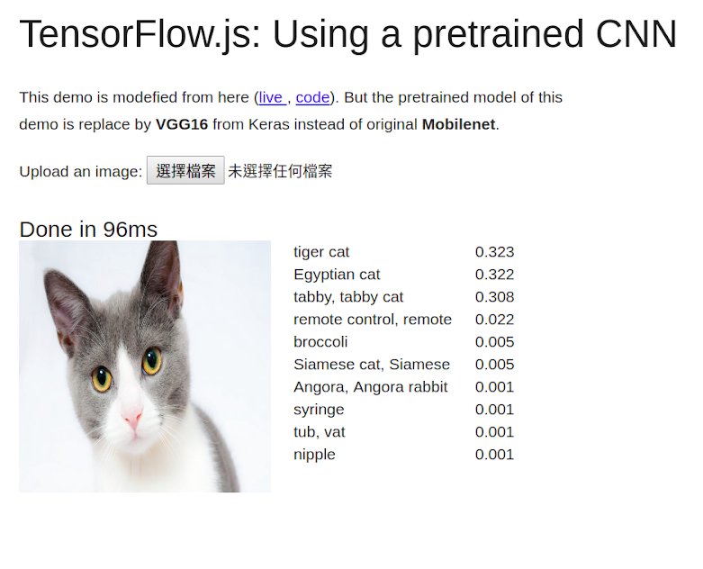

# Generate and Utilize Model Files for Tensorflow.js
- How to **Generate** Model Files of tfjs (inclubing Structure and Weights) ?

  1. Need to install python library `tensorflowjs` first.

  ```shell
  pip install tensorflowjs
  ```

    2. Then convert models from Keras to Tensorflow.js (refer to [here](convert_model_from_keras_to_tfjs.py))


- How to **Utilize** these Model Files?

  1. Publish Model Files to Web and get the Link of `model.json`. For this case, the URL is : http://mobilenet.purelyvivid_tfjs.nctu.me/tfjs_mobilenet/model.json
  2. Download https://github.com/tensorflow/tfjs-examples . In the folder of `mobilenet`, open a file named `index.js`. Modify the `const MOBILENET_MODEL_PATH` to the URL of your model.

  


  3. Confirm your Environment: (could refer to [here](https://github.com/purelyvivid/deeplearning_environment_setup/blob/master/other_toolkit_2.sh) if your OS is Ubuntu)

     > Node.js >=8.9 and <9
     >
     > Yarn 

  4. Run JS code

  ```
  yarn
  yarn watch
  ```

  6. Then you can see the result such like:

     

     > Note: the text in above image is just for modification reference, not actually true.
